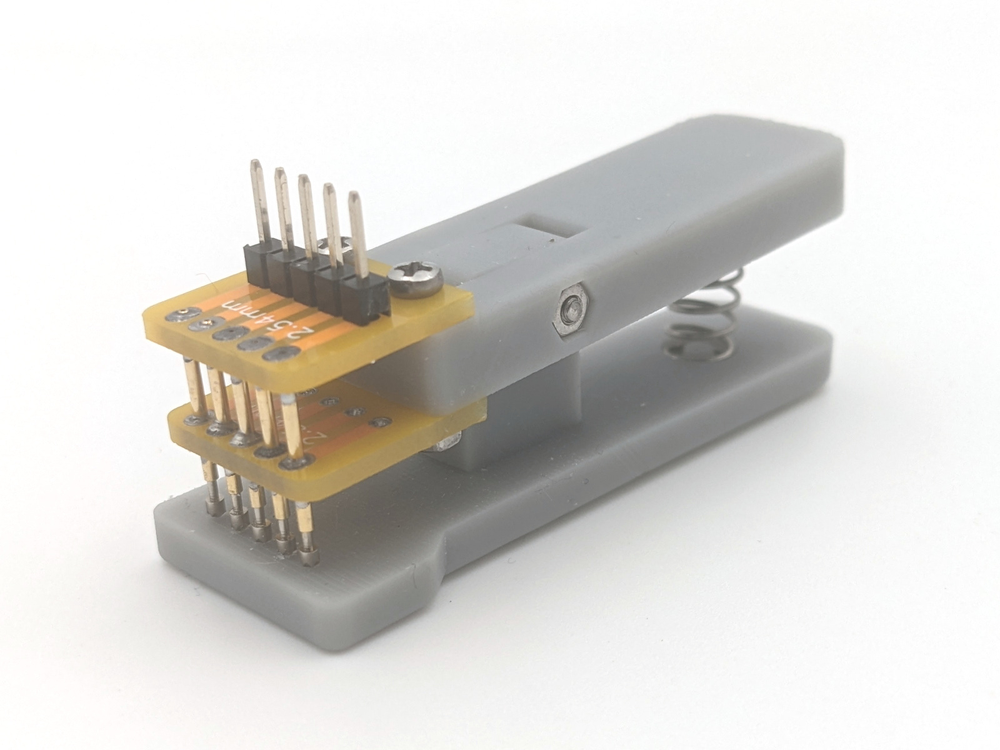
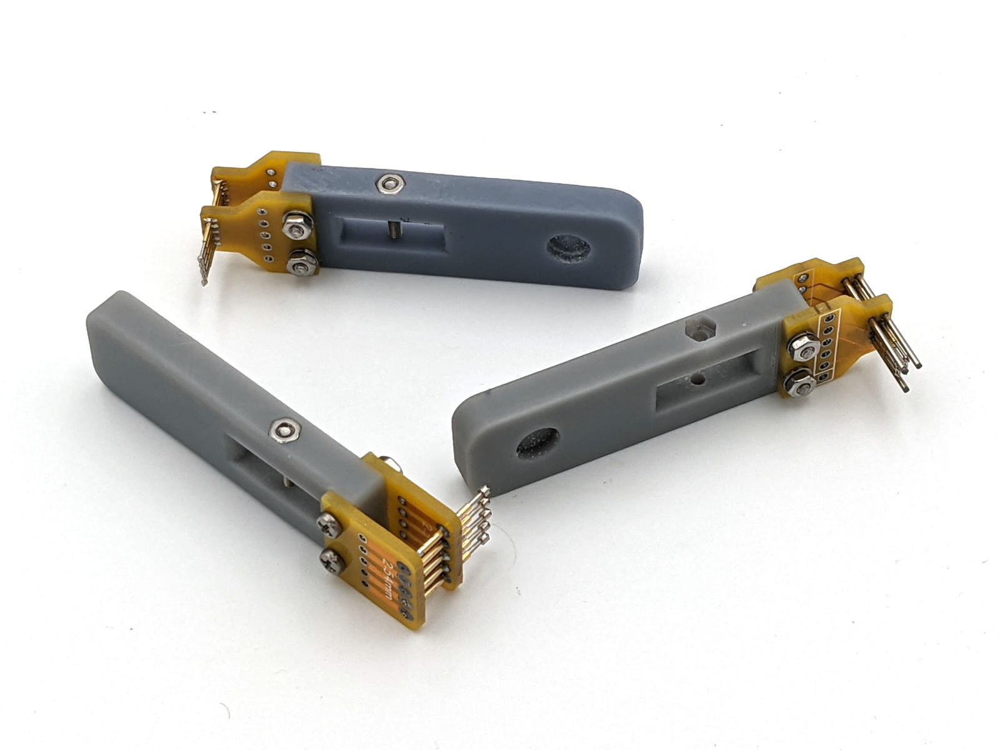
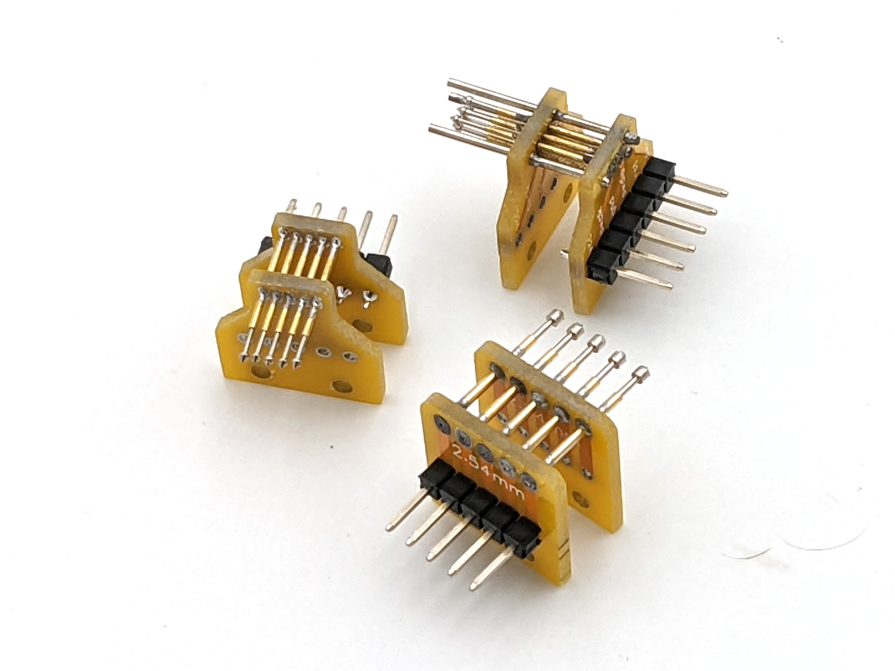
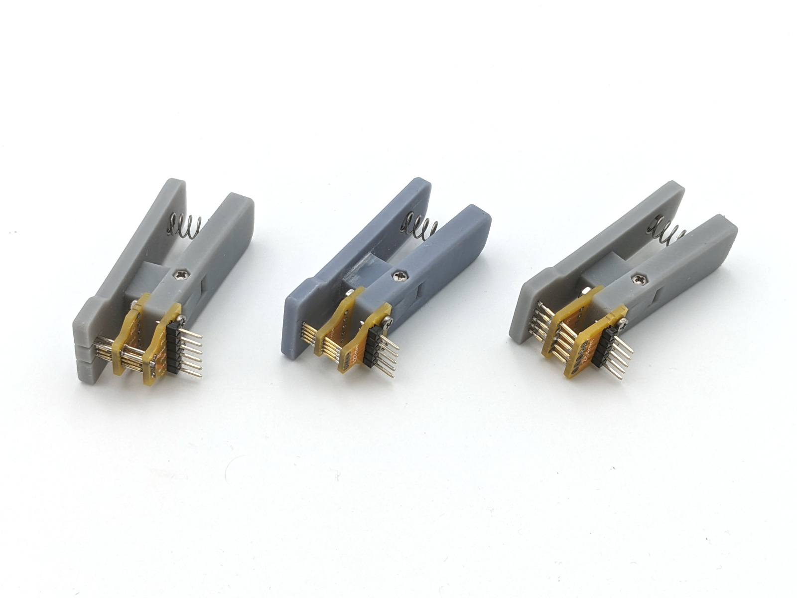

Pogo pins clip <!-- omit in toc -->
==============

> Clips for SWD programming/debugging. Easy to modify for your needs.

- [Components](#components)
- [Assembly](#assembly)
- [Alternatives](#alternatives)

## Components

&nbsp; | Name | Comment
-----|-------------|--------
1 | [PCB](https://oshwlab.com/puzrin/pogo-pins-clip) | Modify if needed
2 | Pogo pin [P50-F1](https://www.aliexpress.com/item/1005003501730262.html)| For 1.27mm step. Alt: [P50-LM2](https://www.aliexpress.com/item/1047975817.html).
3 | Pogo pin [P75-E2](https://www.aliexpress.com/item/32874022638.html)| For 2.54mm step. Alt: [P75-E2](https://www.aliexpress.com/item/32874022638.html), [P75-LM2](https://www.aliexpress.com/item/1047975817.html).
4 | [Spring](https://www.aliexpress.com/item/4001178729297.html) | 0.6\*6\*20mm or 0.7\*6\*15mm should be ok.
5 | [2.54mm pins](https://www.aliexpress.com/item/32993182990.html) |
6 | [M2 12mm screws](https://www.aliexpress.com/item/33012059322.html) | DIN 7985 / ISO 7045. PCB mount.
7 | [M2 14mm screws](https://www.aliexpress.com/item/33012059322.html) | DIN 7985 / ISO 7045. Join plastic parts.
8 | [M2 spring lock washes](https://www.aliexpress.com/item/4000222556028.html) |
9 | [M2 nuts](https://www.aliexpress.com/item/4000226223259.html) |
10 | [0.9mm needles](https://www.aliexpress.com/item/33011464623.html) | Only for TC2030 clip. Stainless steel wire should be ok too.
11 | 3d-printed clip parts | See [3dprint folder](./3dprint/)

Order plastic parts at jlcpcb, with the PCB-s: https://cart.jlcpcb.com/quote?businessType=tdpGoodsFile. Select SLA process and LEDE 6060 material.

## Assembly

First, mount PCB-s and solder pogo pins. Put top PCB on the table to align all
pins and solder from the bottom side.

Then detach PCB-s, mount connector & wash flux off.

Now assemble everything and install spring.

## Alternatives

You can order alternate clips at AliExpress, or use those as base for custom
PCB-s.

- [2.54mm](https://www.aliexpress.com/item/32827181680.html) clip.
- [1.27mm](https://www.aliexpress.com/item/32959606674.html) clip.
